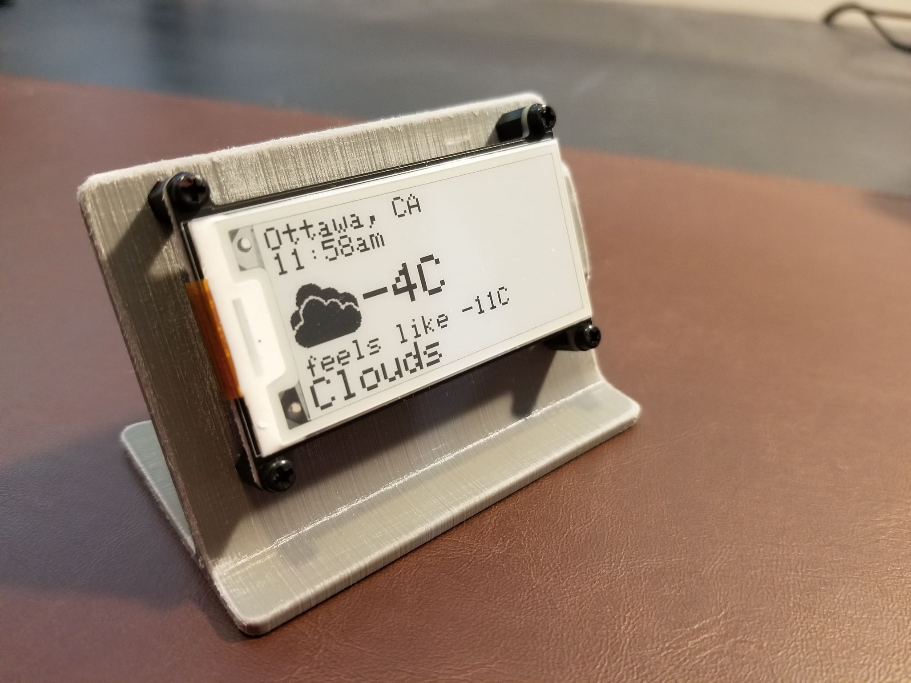
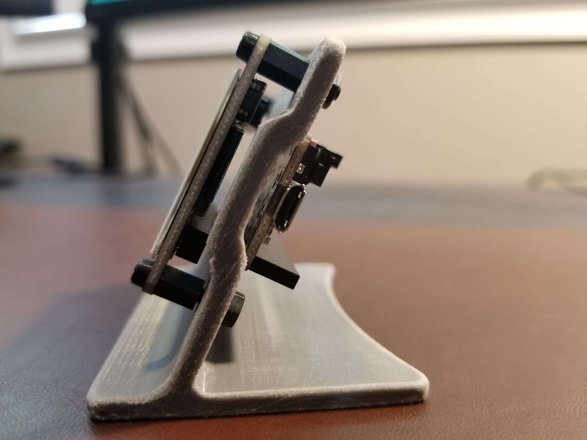

# DesktopWeatherStation
This repository contains the resources required to build a desktop weather station. This compact device is designed to connect to wifi and then periodically request weather updates from the OpenWeatherMaps API. The weather data is displayed on a low power eink display. When the device send a request to the weather API, a JSON string is returned with a variety of values. One of the values is a code which corresponds to a weather icon (clouds, rain, sun, etc.). The program parses this value and then displays the corresponding icon. A microSD card mounted to the microcontroller stores the available icons. The icon format is a monochrome bitmap.

The core components used for this project are:

* Adafruit HUZZAH32 - ESP32 Feather board
* Adafruit 2.13" Monochrome eInk / ePaper Display FeatherWing
* MicroSD card

Optional:

* M2.5 6mm Hex M-F Standoff
* M2.5 6mm Screw
* M2.5 Nut
* 3D Printed Desktop Stand

The design for the 3d printed stand comes from [here][1]

[1]: https://learn.adafruit.com/eink-featherwing-display-stand/ "Title"

The device can be powered via two methods:

* Onboard microUSB port
* JST connector w/ an Adafruit-compatible Lipo

